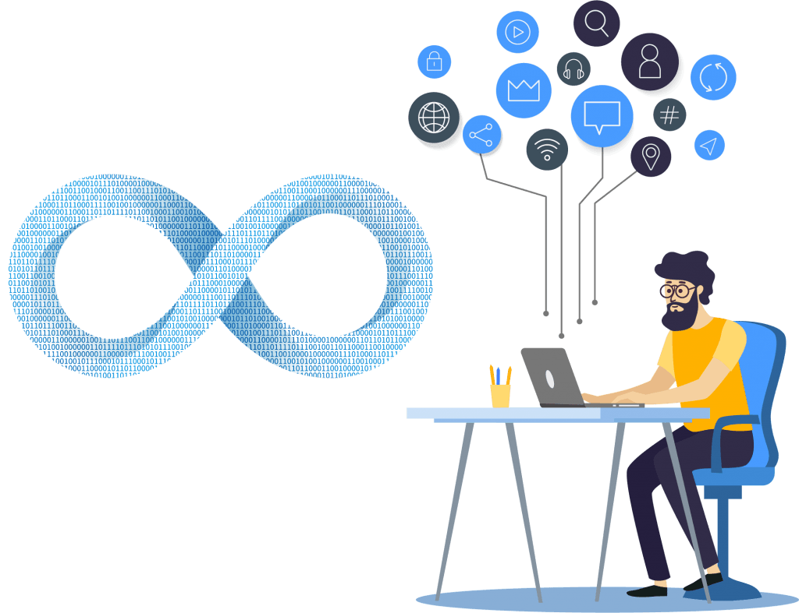

<h1  align="center">

</h1>

<h3  align="center">

DevOps na Prática - Criando uma Pipeline do Zero

</h3>

<!-- Insira aqui a Flag com sua URL do Travis -->

    <a  href="#-o-projeto">Projeto</a>&nbsp;&nbsp;&nbsp;|&nbsp;&nbsp;&nbsp;
    <a  href="#-tecnologias">Tecnologias</a>&nbsp;&nbsp;&nbsp;|&nbsp;&nbsp;&nbsp;
    <a  href="#-devops-na-prática">DevOps na Prática</a>&nbsp;&nbsp;&nbsp;|&nbsp;&nbsp;&nbsp;
    <a  href="#-licença">Licença</a>

## ☕ O Projeto

O projeto consiste em uma aplicação simples para exemplificação e laboratório do curso: **DevOps na Prática - Criando uma Pipeline do Zero.**
Trata-se de um **Hello World** apresentado no Browser de forma diferente.

## ☕ Tecnologias

As Tecnologias usadas no projeto são:

- [Node.js](https://nodejs.org/en/)
- HTML5
- CSS3
- JavaScript
- Mocha
- Chai

Para executar o projeto localmente, basta rodar o comando **npm install** dentro do diretório para baixar as dependências do projeto. Em seguida digite **node app.js** para rodar o App e **npm test** para executar os testes. Acesse **http://localhost:8888** no seu navegador para ver o resultado.

## ☕ DevOps na Prática

O **DevOps na prática** é o meu primeiro curso planejado para hospedagem na plataforma [Udemy](https://udemy.com/).

Curso voltado para usuários Iniciantes e Intermediários que estão dando os primeiros passos no estudo da cultura DevOps e suas particularidades.

## ☕ Licença

Esse projeto está sob a licença MIT.

---

By [Matheus Ferraz](https://www.linkedin.com/in/matheus-ferraz/)
